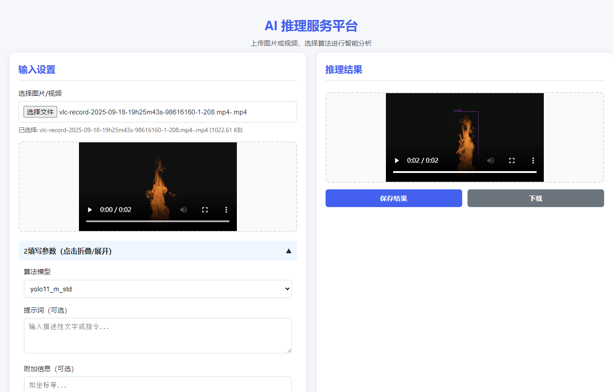

# Visual-Flask 部署框架

一个基于 Flask 的轻量级视觉模型部署框架，支持多种推理引擎（PyTorch/ONNX/TensorRT）和主流视觉模型，提供开箱即用的部署能力及标注导出功能。

## 当前进度 ✅
- **基础架构**  
  - [x] Flask RESTful API 框架搭建
  - [x] 多推理引擎支持（PT/ONNX/TensorRT）
  - [x] 图像/视频流统一处理管道
- **模型支持**  
  - [x] YOLOv11 部署模板
  - [x] RT-DETR 推理集成
  - [ ] YOLOWorld 支持（开发中）
  - [ ] SAM/SAM2 集成（计划中）

## 界面预览  


## 快速开始```bash
# 克隆仓库
git clone https://github.com/newcloud123/visual_flask.git

# 安装依赖
pip install -r requirements.txt

# 启动服务
python app.py